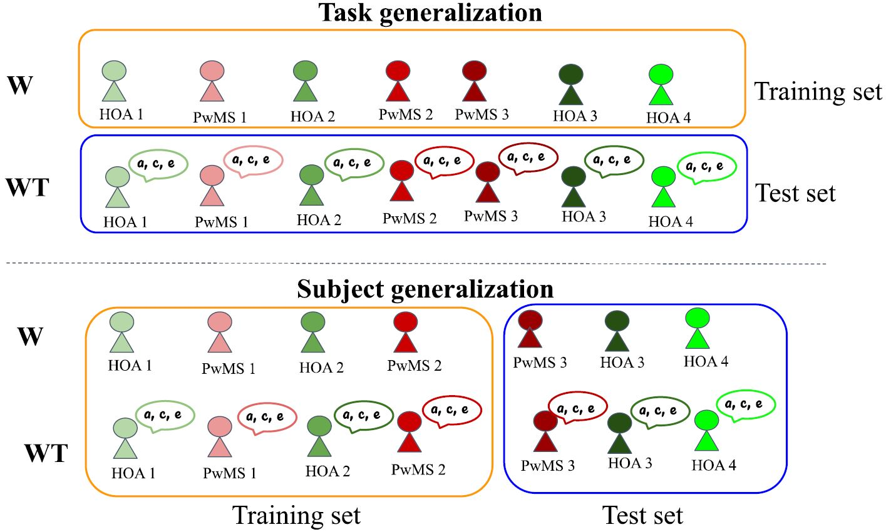

# GML4MS (Gait data-based machine learning (ML) framework for MS prediction)
## Predicting Multiple Sclerosis from Gait Dynamics Using an Instrumented Treadmill - A Machine Learning Approach
This is the code for the paper R. Kaur, Z. Chen, R. Motl, M. E. Hernandez and R. Sowers, "Predicting Multiple Sclerosis from Gait Dynamics Using an Instrumented Treadmill – A Machine Learning Approach," in IEEE Transactions on Biomedical Engineering, doi: 10.1109/TBME.2020.3048142., https://ieeexplore.ieee.org/document/9311191

### Authors:
* Rachneet Kaur, Department of Industrial and Enterprise Systems Engineering at the University of Illinois at Urbana-Champaign, rk4@illinois.edu, https://kaurrachneet6.github.io/
* Zizhang Chen, Department of Mathematics and the Department of Statistics at the University of Illinois at Urbana-Champaign, zizhang2@illinois.edu
* Robert Motl, Department of Physical Therapy at the University of Alabama at Birmingham, Birmingham, AL 35233, USA
* Manuel Hernandez, Department of Kinesiology and Community Health at the University of Illinois at Urbana-Champaign, mhernand@illinois.edu, http://kch.illinois.edu/hernandez
* Richard Sowers, Department of Industrial and Enterprise Systems Engineering and the Department of Mathematics at the University of Illinois at Urbana-Champaign, r-sowers@illinois.edu, http://publish.illinois.edu/r-sowers/

### Abstract:
**Objective:** Multiple Sclerosis (MS) is one of the most common neurological conditions worldwide whose prevalence is now greatest among people 50-60 years of age. While clinical presentations of MS are highly heterogeneous, mobility limitations is one of the most frequent symptoms. The aims of this study were to examine MS and disability related changes in spatiotemporal and kinetic gait features after normalization; and evaluate the effectiveness of a gait data-based artificial intelligence (AI) framework for MS prediction (GAI4MS). \
**Methods:** In this study, gait data during self-paced walking on an instrumented treadmill from 20 persons with MS and 20 age, weight, height and gender-matched healthy older adults (HOA) were obtained.  We explored two normalization strategies, namely *size-N* (standard body size-based normalization) and *regress-N* (regression-based normalization using scaling factors derived by regressing gait features on multiple subject demographics) to minimize the dependency of derived gait features on the subject demographics; and proposed GAI4MS, a machine learning (ML) based methodology to classify individual strides of older persons with MS (PwMS) from healthy controls, so as to generalize across different walking tasks and subjects after gait normalization. \
**Results:** We observed that *regress-N* improved the accuracy of identifying pathological gait using ML when compared to *size-N*. When generalizing from comfortable walking to walking while talking, gradient boosting machine achieved the optimal subject classification accuracy and AUC of 94.3% and 1.0, respectively and for subject generalization, a multilayer perceptron resulted in the best accuracy and AUC of 80% and 0.86, respectively, both with *regress-N* normalized data. \
**Conclusion:** The integration of gait data and ML to predict MS may provide a viable patient-centric approach to aid clinicians in disease monitoring and relapse treatment. This work is the first attempt to employ and demonstrate the potential of ML for this domain. \
**Significance:** The results of this study have future implications for the way regression normalized gait features may be clinically used to design ML-based disease prediction strategies and monitor disease progression in PwMS. \
**Index Terms:** Multiple sclerosis, Gait, Machine learning, Conditional entropy, Progression space


**Top:** Task generalization model, trained on trial W and tested on trial WT. 
**Bottom:** Subject generalization design trained on both trials of sampled subjects and validated on withheld subjects. Healthy older adults (HOA) and PwMS are depicted in shades of green and red, respectively. The indices 1, 2, 3, ... along with HOA and PwMS are used as a reference for dummy subjects identifiers.

### Dependencies
* Python 3.6
* The versions of Python packages can be found in the file requirements.txt

### Code structure:
#### Data Preperation 
* RAW Data:
    * **ButterflyPlot.ipynb**: For plotting the butterfly diagrams, their mean trajectories, and computing the features ((x, y) of the intersection point, ((x-mean_x)^2, (y-mean_y)^2) for the intersection point.
Further, we record the mean intersection point across all strides during the complete walk and standard deviation across interesection points during the entire walk. 
        * The .csv files with features recorded are: ButterflyMeanSD.csv and ButterflyFeatures.csv

    * **FootProgressionAngles.ipnb**: For computing the left and right FPAs and saving to .csv 
        * The .csv file with features recorded is FPA_feature.csv

    * **FeatureExtraction.ipynb**: For creating the final **raw dataframe** combining all the gait features together. 
        * Computes supporting times, stride length, stride width, cadence, stride speed, treadmill speeds, walk ratio, stride time, swing time, stance time, forces. 
        * The .csv files with all the raw features is gait_features.csv

* SIZE NORMALIZED Data:
    *  **DS_Scaling.ipynb**: For performing dimensionless scaling based on Hof, At L. "Scaling gait data to body size." Gait & posture 3, no. 4 (1996): 222-223 to the extracted raw gait features.
        * The .csv files with dimensionless scaled features is size_normalized_gait_features.csv

* REGRESSION NORMALIZED Data:
    * **RegressFeatureExtraction.ipynb**: For extracting the gait features of the 30 new controls only walking trial dataset for regerssion coeffcient extraction.
    * **MultipleRegressionScaling_controlsTrialW.ipynb**: For preforming multiple regression based scaling of gait features using physical charactersitcs of subjects as independent variables
        * The .csv file with MR scaled features is mr_scaled_features.csv' 

#### Vizualization and Statistical analysis
* **VizualizationStatTests.ipynb**: For visual difference and statistical testing on the extracted gait features, correlation between features and disease severity, physical characteristics.

#### Machine learning 
* **TrialGeneralize.ipynb**: For tuning and evaluating task generalization ML models 
* **PeopleGeneralize.ipynb**: For tuning and evaluating the subject generalization ML models 
* **PeopleGeneralizeInvestigateMLP_11layersReduced.ipynb**: For hyperparameter search for subject generalization MLP model 

#### Discussion analysis 
* **AblationStudyMS.ipynb**: For ablation study on the different datastreams for optimal performance 
* **FeatureImportanceMS.ipynb**: For computing the conditional entropies of features and effect on ML performance by eliminating certain features 
* **MSprogression.ipynb**: For studying the progression space using EDSS among persons with MS 
* **Koopman_vizualizations.ipynb**: To vizualize all features (raw and normalized) across both trials for differences between HOA and PwMS
* **EDSSPrediction_21features.ipynb**: To predict mild (EDSS 1-4.5) and moderate (EDSS 5-6) severity among PwMS (both task generalization and subject generalization designs) using all 21 regress-N features 
* **EDSSPrediction_NMFfeatures.ipynb**: To predict mild (EDSS 1-4.5) and moderate (EDSS 5-6) severity among PwMS (both task generalization and subject generalization designs) using the 2 reduced NMF regress-N features 

### Citation:
If you use this code, please consider citing our work:

(1) https://ieeexplore.ieee.org/document/9311191
```
@ARTICLE{9311191,  
author={R. {Kaur} and Z. {Chen} and R. {Motl} and M. E. {Hernandez} and R. {Sowers}},  
journal={IEEE Transactions on Biomedical Engineering},   
title={Predicting Multiple Sclerosis from Gait Dynamics Using an Instrumented Treadmill – A Machine Learning Approach},   
year={2020},  
volume={},  
number={},  
pages={1-1},  
doi={10.1109/TBME.2020.3048142}}
```

(2) https://ieeexplore.ieee.org/abstract/document/8857604
```
@inproceedings{kaur2019exploring,
  title={Exploring Characteristic Features in Gait Patterns for Predicting Multiple Sclerosis},
  author={Kaur, Rachneet and Menon, Sanjana and Zhang, Xiaomiao and Sowers, Richard and Hernandez, Manuel E},
  booktitle={2019 41st Annual International Conference of the IEEE Engineering in Medicine and Biology Society (EMBC)},
  pages={4217--4220},
  year={2019},
  organization={IEEE}
}
```
